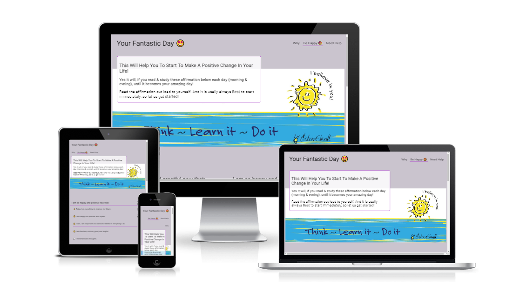
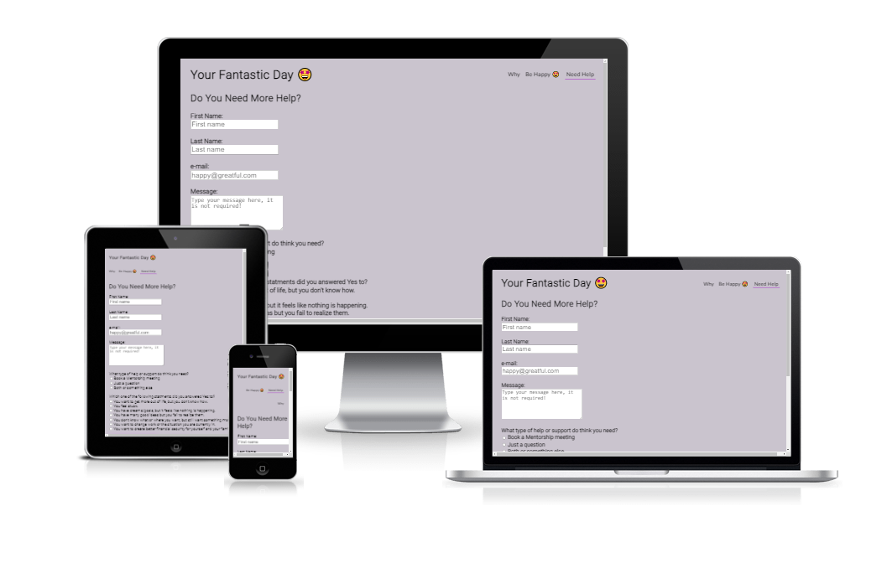

# Your Fantastic Day

This webpage will challenge you to start creating a change in your everyday life. We do that by inspire you, give you hope, and a good start to becoming a more happy and grateful person every day. It will start by letting you Think through some challanging questions. Then we giude you through some positive affirmation on how you can start each and every morning and ending the evenings with, to becoming a more happy and greatful person.

## Features 

Every affirmation will start with this line "I am so happy and gratefull now that..." then the affirmation will take you on an amazing journy from starting your day until you end the day.

The "Challenge" page is the where your mind starts to "Think".
The "Be Happy" page is where you start to "Learn" how to become a more happy and greatful person.
The "Need Help" page is where you take the next step and ask for more help and support to "Do" and become greatfull and happier person.

### Existing Features

- __Navigation Bar__

  - Featured on all three pages, the full responsive navigation bar includes links to the Logo, Why, Be Happy and the Need Help page page and the main view is identical on each page to allow for easy navigation.
  - This section will allow the user to easily navigate from page to page across all devices without having to revert back to the previous page via the ‘back’ button.

- __The landing page image__

  - The landing includes a photograph with text overlay to interact with the user and inspire them to take the challenge questions/statments and from there take action. 
  - This section introduces the user to the Challenge with an eye catching animation to grab their attention.

- __The Challenging Questions/statments Section__

  - The Challenging Questions/staments will allow the user to start to Think and guide them to start to be more happy and greatful through a CTA = Go to the Be Happy page or a direct CTA for go to page Need Help.

- __The Footer__ 

  - The footer section includes links to the relevant social media sites for further guidance to becoming a more happy and greatfull person. 
  - The footer is valuable to the user as it encourages them to keep connected via social media.

- __The Be Happy page__

  - The Be Happy page will provide and inspire the user with positive affirmation and some supporting images/picture to increase the affirmations on a visual perspective. 
  - This section will guide the user to becoming a more happy and greatful person if it is readed at least every morning and evning. 

- __The Need Help page__

  - This page will allow the user to ask for help by submitting a form, name, e-mail, some message text, and some questions for mentorship meeting or just questions. The user will be asked to submit their full name and email address. 

### Features Left to Implement

- downloadable pdf files
- videos, audio
- update the form with better info of missing parts and this is what they have typed do you what to send it
- interaction with the user in some way when they read the pages questions/staments, and affirmation
- blogg

## Testing 
 
I have used gitpod, github, and google devtools under my design and texting phases. Used git commands for saving and pushing the code from gitpod to github.

Under the testings I have only used google chrome as webbrowser.

Problems or issues under the design and testing have been a lot. because I am just in my begining to become a full stack coder. Basic typing errors, used wrong tags, elements, attributes etc. I have used code Institute as a baseline for information, slack community, w3school for guidence. And also used my mentor for the code institute for support.

### Validator Testing 

- HTML
  - No errors were returned when passing through the official [W3C validator](https://validator.w3.org/nu/?doc=https%3A%2F%2F777osek.github.io%2Fyour-fantastic-day%2Findex.html)
- CSS
  - No errors were found when passing through the official [(Jigsaw) validator](https://jigsaw.w3.org/css-validator/validator?uri=https%3A%2F%2F777osek.github.io%2Fyour-fantastic-day%2Findex.html&profile=css3svg&usermedium=all&warning=1&vextwarning=&lang=sv)

### Unfixed Bugs

You will need to mention unfixed bugs and why they were not fixed. This section should include shortcomings of the frameworks or technologies used. Although time can be a big variable to consider, paucity of time and difficulty understanding implementation is not a valid reason to leave bugs unfixed. 

## Deployment

This section should describe the process you went through to deploy the project to a hosting platform (e.g. GitHub) 

- The site was deployed to GitHub pages. The steps to deploy are as follows: 
  - In the GitHub repository, navigate to the Settings tab 
  - From the source section drop-down menu, select the Master Branch
  - Once the master branch has been selected, the page will be automatically refreshed with a detailed ribbon display to indicate the successful deployment. 

The live link can be found here - [your-fantastic-day](https://777osek.github.io/your-fantastic-day/index.html) 

## Credits 

The credits go to Östen Ekvall for his content the text an all pages, and the code institute and there Love Running project as this has been the base for my web design. The buttoms was basicly coded from this site https://buttonoptimizer.com/. Ofcause the W3school for there site and helping guides etc. https://www.w3schools.com/
 

### Content 

- All content text is coming from Östen Ekvall and his affirmation template for becoming a more happy and greatful person every day
- many of icons were taken from [Font Awesome](https://fontawesome.com/) but also standard emojs from https://emojipedia.org/wrapped-gift/

### Media

- The photos/images comes from Östen Ekvall

Congratulations this is my very first Readme, I hope you will have a happy and greatful life as developer or as amazing person! 
